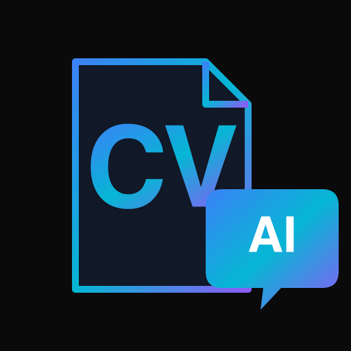

  

<h1 align="center">AI-ассистент соискателя</h1>

  Автоматизация поиска работы и фриланс-заказов. 
  Наводит порядок в хаосе множества откликов и ускоряет их создание с помощью AI.

---

**Главная задача проекта** — быть персональным ассистентом, который:
- **AI-генерирует отклики** из вакансий и фриланс-заказов (FL.ru и др.)
- **Ведёт единую базу откликов** со статусами, бюджетами, дедлайнами, рейтингами
- **Отслеживает просмотры** от HR и заказчиков (кто, когда, сколько раз)
- **Превращает резюме в интерактивный сайт** с AI-чатом для рекрутёров

Любой разработчик может развернуть такой сервис под своё CV: меняется только контент (markdown) и домен.

Живой пример: **[cv.libera.pro](https://cv.libera.pro)**.

## Что умеет

### Для соискателя (админ-панель)

- ⚡ **AI-генерация откликов** — вставляете текст вакансии или фриланс-заказа → LLM создаёт адаптированный CV и cover letter → split-редактор с live-preview → публикация с короткой ссылкой
- 🚀 **Фриланс-режим** — отдельные типы откликов (vacancy/freelance/contest): бюджет, дедлайн, рейтинг звёздами. Загрузка ТЗ из PDF → парсинг → в промпт → более релевантный отклик
- 🏆 **Конкурсы FL.ru** — третий тип откликов с отдельным промптом: тон участника конкурса, акцент на скорость и AI, оценка реалистичности участия (укладываемся ли в дедлайн)
- 📦 **Артефакты конкурсов** — загрузка файлов (APK, видео, исходники) к отклику → публичная ссылка `/dl/{code}` для заказчика → аналитика скачиваний. Ссылки активны, пока отклик не архивирован
- 📋 **База откликов** — статусы (черновик/активен/архив), фильтр по типу, ссылки на вакансию и диалог с HR, редактирование всех полей после создания
- 📄 **PDF-экспорт** — скачивание CV в PDF (Unicode, кириллица) для отклика на FL.ru
- ⚙ **Настройки в БД** — мастер-CV, README и промпты редактируются через админку (AI-правка CV по инструкции), без деплоев

### Для рекрутёра (публичная часть сайта)

- 🤖 **AI-ассистент** — рекрутёр задаёт вопросы в чат («какие проекты на Flutter?», «делал ли DevOps?»), модель (glm-5.2 от Z.ai) отвечает **по фактам из CV** в реальном времени (Server-Sent Events). Диалог сохраняется — контекст не теряется при перезагрузке
- 🕸 **Граф знаний** — визуализация связей проектов и технологий
- 🔗 **Персональная ссылка** — под каждую вакансию, с TTL и аналитикой открытий

### Аналитика

- 👤 **Трекинг уникальных посетителей** — session_id + cookie, каждому присваивается имя («Крепкий Кабан», «Деловой Барсук»). Tooltip на «уникальных: N» показывает, кто именно заходил
- 💬 **Просмотр HR-чатов** — все диалоги рекрутёров в админке, сгруппированы по откликам

## Архитектура (два репозитория)

| Репозиторий | Стек | Назначение |
|-------------|------|-----------|
| [cv-backend](https://github.com/interactive-cv/cv-backend) | Python, FastAPI, PostgreSQL | REST API, AI-промпты (чат + генерация + freelance + contest + правка CV), PDF-экспорт, трекинг, сессии, аналитика |
| [cv-frontend](https://github.com/interactive-cv/cv-frontend) | Next.js 16, TypeScript, Tailwind | SSR-лендинг, граф, чат-виджет с историей, админ-панель (отклики/фриланс/конкурсы/настройки/чаты), OG-превью |

## Технологические решения

### AI-интеграция

- **RAG без векторной БД** — весь текст CV подаётся как контекст в системном промпте (дешевле pgvector). И в чате, и в генераторе откликов.
- **Защита от галлюцинаций** — жёсткий промпт запрещает выдумывать опыт/метрики/работодателей + e2e-тесты против реальной glm-5.2 на провокационных запросах
- **Стриминг** — токены идут в браузер по мере генерации (SSE), как в ChatGPT
- **Graceful degradation** — при сбое LLM чат отдаёт контакты, остальной сайт работает

### Инженерные решения

- **Кросс-БД типы** — тесты на SQLite, прод на PostgreSQL без изменения кода
- **Атомарный инкремент** счётчика кликов без race condition
- **Авто-TLS** — nginx + Let's Encrypt, сертификаты автоматически
- **67 unit-тестов + 3 e2e**

## Развёртывание

Полное руководство по разворачиванию, деплою и настройке — **[QUICKSTART.md](https://github.com/interactive-cv/cv-backend/blob/master/QUICKSTART.md)**
в репозитории cv-backend. Локальная разработка, production-деплой на VPS,
конфигурация всех переменных, настройка промптов и защита от дрифта.

## Дорожная карта

- [x] Универсализация шаблона (env-параметризация)
- [x] Админ-панель с AI-генерацией откликов
- [x] Фриланс-режим (бюджет, рейтинг, ТЗ из PDF)
- [x] Экспорт CV в PDF
- [x] Настройки в БД (CV/README/промпты через админку, AI-правка CV)
- [x] Продолжение диалога HR (сессии, история)
- [x] Трекинг посетителей + просмотр чатов
- [x] Конкурсы FL.ru (третий тип откликов, отдельный промпт)
- [x] Контрибьютинг-гайд и лицензия MIT
- [x] Напоминалка о собеседовании (CRUD + дашборд «Ближайшие»)
- [x] Snapshot промпта на каждый отклик (воспроизводимость)
- [x] Тёмная/светлая тема (next-themes)
- [x] Артефакты конкурсов (загрузка APK/видео, публичные ссылки /dl/{code})

## Лицензия

MIT. Проект открыт для использования и контрибуции. См. [LICENSE](https://github.com/interactive-cv/cv-backend/blob/main/LICENSE) и [CONTRIBUTING.md](https://github.com/interactive-cv/cv-backend/blob/main/CONTRIBUTING.md).
